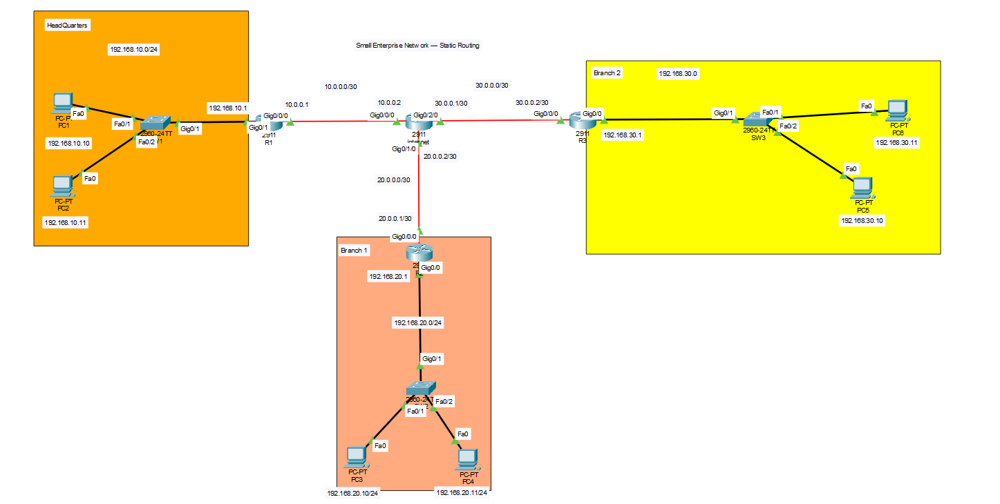

# Enterprise Network — IPv4 Static Routing

A small enterprise network simulation built with **Cisco Packet Tracer** to practice IPv4 addressing, directly connected routes, static routing, and basic network verification.

## 📌 Project Overview

This project simulates a small enterprise network consisting of:

- Headquarters (HQ)
- Branch Office 1
- Branch Office 2
- An intermediate router representing the WAN/Internet network
- Multiple PCs connected through switches

The main objective is to configure the network using **IPv4 static routing** so that devices in different LANs can communicate with each other.

---

## 🗺️ Network Topology



The network consists of three internal LANs connected through an intermediate WAN/Internet router.

### Network Structure

```text
                         WAN / INTERNET
                             
                10.0.0.0/30     30.0.0.0/30
        R1 ───────────────── Internet ───────────────── R3
        │                     │                         │
        │                     │                         │
   HQ LAN                 20.0.0.0/30              Branch 2
192.168.10.0/24              │                    192.168.30.0/24
        │                     │                         │
       SW1                   R2                        SW3
      /   \                   │                       /   \
    PC1   PC2            Branch 1                   PC5   PC6
                         192.168.20.0/24
                              │
                             SW2
                            /   \
                          PC3   PC4
